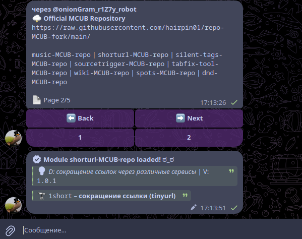
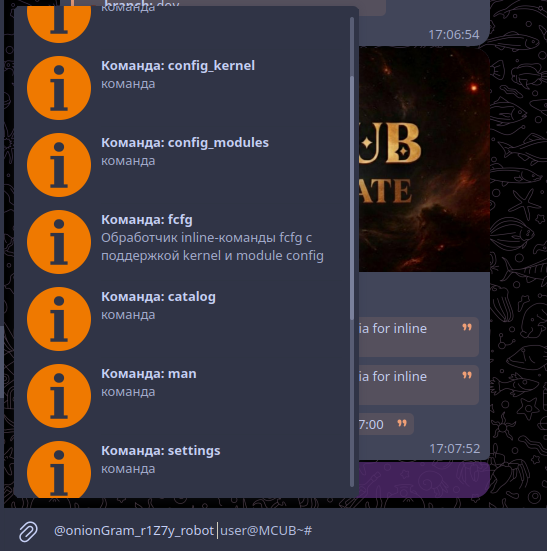
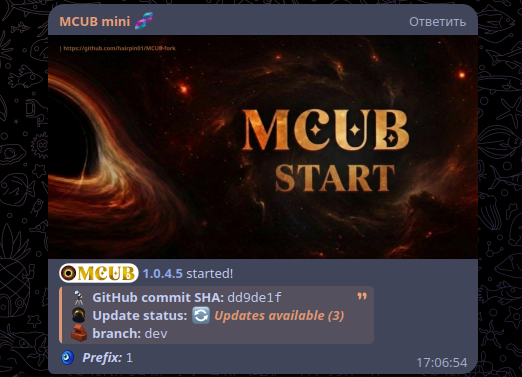
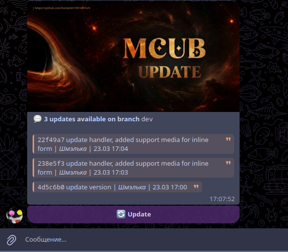

<div align="center">


</div>

[](https://github.com/nulls-brawl-site/mcub-go)
[](https://github.com/nulls-brawl-site/mcub-go/commits/main)
[](https://github.com/nulls-brawl-site/mcub-go/issues)
[](https://github.com/nulls-brawl-site/mcub-go/stargazers)
[](https://github.com/nulls-brawl-site/mcub-go/blob/main/LICENSE)

# mcub-go

Go port of [MCUB-fork](https://github.com/hairpin01/MCUB-fork) — Telegram userbot.

[English](#english) | [Русский](#русский)

<details>
<summary><i>Screenshots <b>(click)</b></i></summary>

   <div align="left">

   

   </div>

   <div align="left">

   

   </div>

   <div align="left">

   

   </div>

   <div align="left">

   

   </div>
</details>

---

## English

`mcub-go` is a complete Go port of MCUB-fork — a Telegram userbot.

> [!IMPORTANT]
> **Go 1.26+ and GCC required** (GCC is needed by the CGo SQLite driver).

### Quick start

```bash
git clone https://github.com/nulls-brawl-site/mcub-go.git && cd mcub-go
cp config.example.json config.json
# Fill in api_id, api_hash, phone in config.json
go build ./cmd/mcub
./mcub
```

### CLI flags

| Flag | Default | Description |
|------|---------|-------------|
| `--config` | `config.json` | Path to config file |
| `--core` | `standard` | Kernel type: `standard` or `zen` |
| `--no-web` | `false` | Disable web panel |
| `--port` | `8080` | Web panel port |
| `--host` | `127.0.0.1` | Web panel host |
| `--set-default-core` | | Save selected core as default |
| `--clear-default-core` | | Clear default core |
| `--log-level` | `info` | Log level: `debug`, `info`, `warn`, `error` |
| `--version` | | Print version and exit |

### Commands

- `.ping` — check latency
- `.info` — userbot info
- `.restart` — restart
- `.iload` — install module *(reply to `.py` file)*
- `.man [name]` — list modules and commands
- `.um [name]` — remove module
- `.dlm [name]` — install module from official repo

> [!TIP]
> **Security:** Do NOT install suspicious modules. Enable API protection: `.api_protection`

### Modules

User modules are installed via `.iload` (reply to a `.py` file) or `.dlm [name]`.
Module directory: `modules_loaded/`.

### Support
Telegram chat [*click here*](https://t.me/+LVnbdp4DNVE5YTFi)

### Official Repositories (`.dlm`)
Install: `.dlm {module name}` — or without arguments to browse all modules

Module list *(without inline bot)*: `.dlm -list {module name / nothing}`

---

## Русский

`mcub-go` — полный порт [MCUB-fork](https://github.com/hairpin01/MCUB-fork) на Go.

> [!IMPORTANT]
> **Требуются Go 1.26+ и GCC** (GCC нужен для CGo-драйвера SQLite).

### Быстрый старт

```bash
git clone https://github.com/nulls-brawl-site/mcub-go.git && cd mcub-go
cp config.example.json config.json
# Заполните api_id, api_hash, phone в config.json
go build ./cmd/mcub
./mcub
```

### Аргументы командной строки

| Флаг | По умолчанию | Описание |
|------|-------------|----------|
| `--config` | `config.json` | Путь к файлу конфигурации |
| `--core` | `standard` | Тип ядра: `standard` или `zen` |
| `--no-web` | `false` | Отключить веб-панель |
| `--port` | `8080` | Порт веб-панели |
| `--host` | `127.0.0.1` | Хост веб-панели |
| `--set-default-core` | | Сохранить ядро как дефолтное |
| `--clear-default-core` | | Очистить дефолтное ядро |
| `--log-level` | `info` | Уровень логов: `debug`, `info`, `warn`, `error` |
| `--version` | | Вывести версию и выйти |

### Команды

- `.ping` — проверка задержки
- `.info` — информация о юзерботе
- `.restart` — перезагрузка
- `.iload` — установить модуль *(ответом на `.py` файл)*
- `.man [название]` — список модулей и команд
- `.um [название]` — удалить модуль
- `.dlm [название]` — установить модуль из официального репозитория

> [!TIP]
> **Безопасность:** НЕ устанавливайте подозрительные модули. Включите защиту API: `.api_protection`

### Модули

Пользовательские модули устанавливаются через `.iload` (ответом на `.py` файл) или `.dlm [название]`.
Директория модулей: `modules_loaded/`.

### Поддержка
Чат в Telegram [*жмяк*](https://t.me/+LVnbdp4DNVE5YTFi)

### Официальные репозитории (`.dlm`)
Установить: `.dlm {название модуля}` — или без аргументов для просмотра всех

Список модулей *(без inline бота)*: `.dlm -list {название / ничего}`
